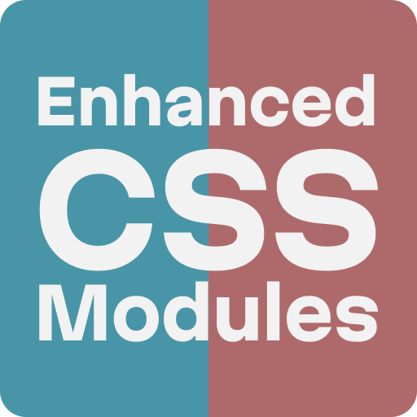

# Enhanced CSS Modules



Enhanced CSS Modules provides smart editor support for CSS Modules in VS Code —
autocomplete, go-to-definition, and rename/refactor support for class names.

Features

- Autocomplete class names from CSS Modules
- Go to definition for class names (jump to CSS file)
- Rename/Refactor class names across JS/TS and style files

Supported languages

- JavaScript / TypeScript (+ React variants)
- Astro
- CSS, SCSS, Sass, Less, Stylus (for rename support)

Installation

- Install from the VS Code Marketplace (search "Enhanced CSS Modules").
- From source (requires pnpm):

```bash
pnpm install
pnpm run compile
```

Usage

- Import a CSS module in your file and start typing class names to get suggestions.

Example

```javascript
import styles from "./sample.css";

const className = styles.container; // autocomplete and go-to-definition
```

- Use "Go to Definition" (F12 / Cmd+Click) on a class name to jump to its CSS rule.
- Rename class names to update usages across supported files.
- Run "Enhanced CSS Modules: Create CSS Module" from a supported JS/TS/Astro file to create
  `FileName.module.css` next to the open file, or choose another target folder.
- Run "Enhanced CSS Modules: Toggle CSS Module" to switch between a JS/TS/Astro file and its matching
  `*.module.css` file when one exists. Exact and kebab/Pascal name pairs are supported, for example
  `ButtonPrimary.tsx` and `button-primary.module.css`.

Configuration

- `enhancedCssModules.camelCase` (boolean|string): Transform classnames in autocomplete suggestions. Default: `false`.
- `enhancedCssModules.pathAlias` (object): Map path aliases for import resolution. Example:
- `enhancedCssModules.createCssModule.targetFolder` (string): Default folder for new CSS module files. Leave empty
  to create files next to the current file. Relative paths resolve from the workspace folder and `${workspaceFolder}`
  is supported.
- `enhancedCssModules.debugPerformance` (boolean): Log provider timing information to the
  "Enhanced CSS Modules Performance" output channel. Default: `false`.

```json
"enhancedCssModules.pathAlias": { "@/": "src/" },
"enhancedCssModules.createCssModule.targetFolder": "${workspaceFolder}/src/styles",
"enhancedCssModules.debugPerformance": false
```

Suggested keybinding

The extension does not claim a default shortcut. Add your preferred binding in Keyboard Shortcuts JSON:

```json
{
	"key": "cmd+alt+m",
	"command": "enhancedCssModules.toggleCssModule",
	"when": "editorTextFocus"
}
```

Rename behavior

- The extension shows and preserves the actual CSS selector names (for example
  `class-name--active`) when you perform a rename — even if you access the
  class in code using camelCase (for example `styles.classNameActive`).
- During a rename operation the editor displays and updates the pretty CSS
  class (kebab-case / BEM-style), and the corresponding JS/TS accessors are
  updated to remain valid. This keeps your source code ergonomic while
  preserving readable CSS in the stylesheet.
- Current limitation: rename matching does not understand JavaScript or
  TypeScript scope shadowing. If you import a module as `styles` and later
  declare another local `styles` variable, rename may still treat
  `styles.className` as a CSS Module usage.

Example

```text
Before: styles.classNameActive  -> CSS: .class-name--active
After renaming to "is-active": CSS becomes .is-active and JS updates accordingly
```

Development

- Build: `pnpm run compile`
- Run tests: `pnpm test`
- Watch/build continuously: `pnpm run watch`
- Lint & format: `pnpm run lint`

Contributing

- Open issues or PRs — follow the existing code style and run tests before submitting.

License

- MIT — see the `LICENSE` file.

Acknowledgements

- This project is inspired by and builds on ideas from the CSS Modules ecosystem. Specifically, the [CSS Modules VS Code extension by clinyong](https://github.com/clinyong/vscode-css-modules)
